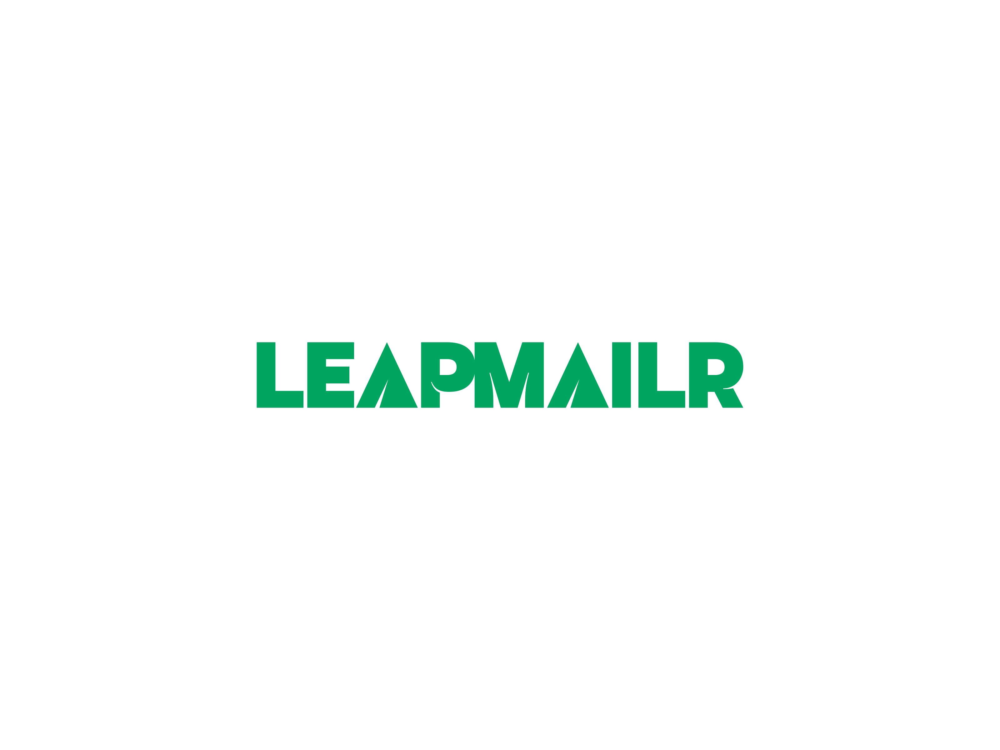

# LeapMailr - Professional Email Service Platform



## Overview

LeapMailr is a powerful email service platform that enables developers and businesses to send transactional emails with ease. Built with Go and featuring a modern web dashboard, LeapMailr provides a complete solution for managing email delivery, templates, and analytics.

## What LeapMailr Does

**Email Delivery Made Simple**
- Send transactional emails through a REST API or web dashboard
- Support for multiple email providers (SMTP, SendGrid, Mailgun, Amazon SES)
- Automatic failover between providers for maximum reliability
- Bulk email sending with personalization

**Template Management**
- Create and manage HTML email templates with dynamic variables
- Version control for your templates
- Visual template editor with live preview
- Template testing before deployment

**Analytics & Monitoring**
- Real-time email delivery tracking
- Detailed analytics on open rates, click rates, and delivery status
- Performance metrics and insights
- Email history and logs

**Developer-Friendly**
- RESTful API with comprehensive documentation
- JWT-based authentication
- API key management
- Rate limiting and security features
- Webhook notifications for email events

**Modern Dashboard**
- Beautiful, responsive web interface
- Real-time statistics and charts
- Template editor with code and preview modes
- User and organization management
- Role-based access control

## Key Features

✨ **Multi-Provider Support** - Integrate with SMTP, SendGrid, Mailgun, or Amazon SES  
🔒 **Secure Authentication** - JWT tokens with refresh mechanism  
📊 **Advanced Analytics** - Track delivery rates, opens, and clicks  
🎨 **Template System** - Dynamic templates with variable substitution  
⚡ **High Performance** - Built with Go for speed and efficiency  
🔄 **Automatic Failover** - Switch providers automatically if one fails  
📧 **Bulk Sending** - Send thousands of personalized emails  
🎯 **Rate Limiting** - Protect your infrastructure  
📱 **Responsive Dashboard** - Works on desktop and mobile  
🔐 **API Keys** - Secure programmatic access  

## Getting Started

### Quick Start with Docker

The fastest way to get LeapMailr running:

```bash
# Clone the repository
git clone <your-repo>
cd leapmailr/docker-compose

# Run the setup script
# Windows:
docker-setup.bat

# Linux/Mac:
chmod +x docker-setup.sh
./docker-setup.sh

# Access the dashboard
# http://localhost:3000
```

See [docker-compose/DOCKER-QUICKSTART.md](docker-compose/DOCKER-QUICKSTART.md) for detailed instructions.

### Manual Installation

#### Prerequisites

- Go 1.22 or higher
- PostgreSQL 15+
- Node.js 18+ (for the dashboard)

#### Backend Setup

```bash
# Install dependencies
go mod download

# Configure environment
cp .env.example .env
# Edit .env with your settings

# Run migrations
go run main.go migrate

# Start the server
go run main.go
```

#### Frontend Setup

```bash
cd ../leapmailr-ui

# Install dependencies
npm install

# Configure environment
echo "NEXT_PUBLIC_API_URL=http://localhost:8080/api/v1" > .env.local

# Start development server
npm run dev
```

## Configuration

LeapMailr is configured through environment variables. Key settings:

### Email Services

Email providers (SMTP, SendGrid, Mailgun, etc.) are now configured through the Email Service API endpoints after authentication. No environment variables are required for email configuration.

Use the `/api/v1/email-services` endpoints to:
- Create and manage email service configurations
- Set default email service for your account
- Test email service connectivity

### Database
```env
DB_HOST=localhost
DB_PORT=5432
DB_USER=leapmailr
DB_PASSWORD=your-password
DB_NAME=leapmailr
```

### Security
```env
JWT_SECRET=your-secret-key-minimum-32-characters
JWT_EXPIRY=24h
REFRESH_TOKEN_EXPIRY=168h
```

## Using LeapMailr

### Web Dashboard

1. **Create an Account**
   - Visit http://localhost:3000
   - Click "Get Started" and fill in your details
   - Login with your credentials

2. **Create Email Templates**
   - Navigate to Dashboard > Templates
   - Click "New Template"
   - Design your email with HTML and variables
   - Save and test

3. **Send Emails**
   - Go to Dashboard > Send Email
   - Select a template
   - Add recipients
   - Fill in template variables
   - Send immediately or schedule

4. **Monitor Performance**
   - Dashboard > Analytics
   - View delivery statistics
   - Track engagement metrics
   - Export data for analysis

### API Usage

**Authentication**
```bash
# Register
curl -X POST http://localhost:8080/api/v1/auth/register \
  -H "Content-Type: application/json" \
  -d '{
    "email": "user@example.com",
    "password": "securepassword",
    "first_name": "John",
    "last_name": "Doe"
  }'

# Login
curl -X POST http://localhost:8080/api/v1/auth/login \
  -H "Content-Type: application/json" \
  -d '{
    "email": "user@example.com",
    "password": "securepassword"
  }'
```

**Send Email**
```bash
curl -X POST http://localhost:8080/api/v1/emails/send \
  -H "Authorization: Bearer YOUR_TOKEN" \
  -H "Content-Type: application/json" \
  -d '{
    "template_id": "template-uuid",
    "to": "recipient@example.com",
    "subject": "Welcome to Our Platform",
    "parameters": {
      "name": "John Doe",
      "verification_link": "https://example.com/verify"
    }
  }'
```

**Bulk Send**
```bash
curl -X POST http://localhost:8080/api/v1/emails/bulk \
  -H "Authorization: Bearer YOUR_TOKEN" \
  -H "Content-Type: application/json" \
  -d '{
    "template_id": "template-uuid",
    "recipients": [
      {
        "email": "user1@example.com",
        "parameters": {"name": "User One"}
      },
      {
        "email": "user2@example.com",
        "parameters": {"name": "User Two"}
      }
    ]
  }'
```

## Contributing
We welcome contributions to LeapMailr! If you have an idea for improving the service, please open an issue or submit a pull request.

## Support
If you have any questions or issues with LeapMailr, please contact us at support.leapmailr@dhawalhost.com

## License
LeapMailr is free software; you can redistribute it and/or modify it under the terms of the MIT License.

## Built With
Golang - Golang is used to build LeapMailr

## Authors and Acknowledgment
LeapMailr was initial built by [Dhawal Dyavanpalli](https://github.com/dhawalhost). It is a free and open-source project.

## Versioning
This is still in development. We will be releasing new versions as we continue to improve the service.

## Disclaimer
LeapMailr is a tool for managing user inquiries from website 'Contact Us' forms. It is not responsible for the content of the inquiries or the actions taken by the recipients. Use of LeapMailr is at the user's own risk.
